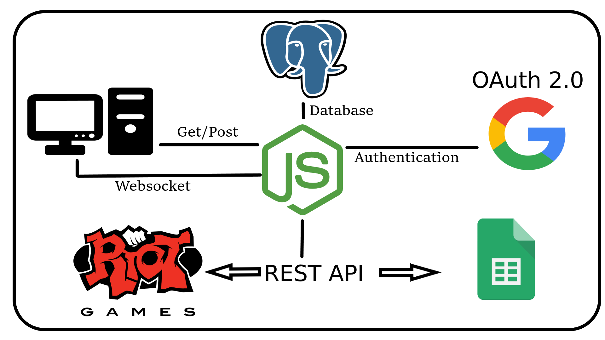
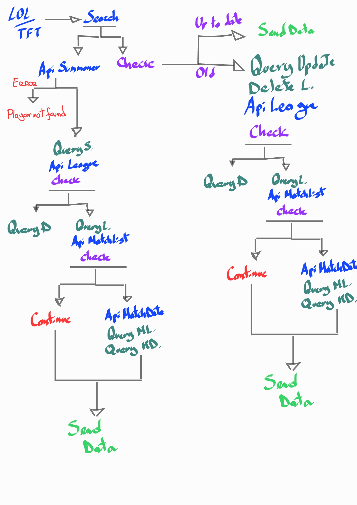
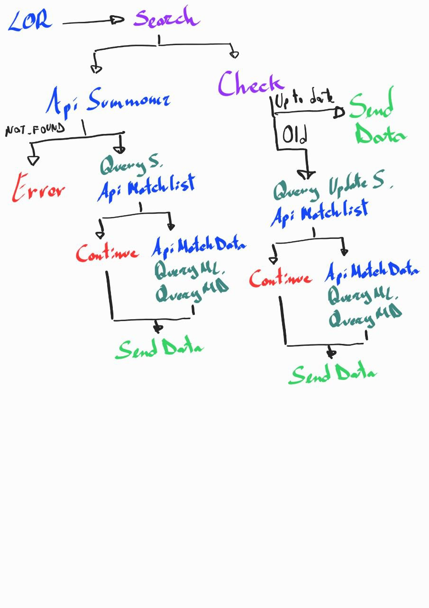

# Progetto per Reti di calcolatori, Linguaggi e tecnologie per il web(Sapienza) 

## Studenti: 
* Riccardo Puccetti(1856168)
* Ayrton Leyva Saldana(1843218) 
***
## Scopo del progetto:
* RPP è un'applicazione client-server che offre agli utenti la possibilità di consultare le statistiche e le informazioni relative ai giocatori di League of Legends, Legends of Runeterra e Team Fight Tactics. Nello specifico permette di consultare i dati relativi alle ultime 5 partite giocate, i dati del giocatore relativi alla stagione corrente ed un sistema(pensato per coloro che organizzano tornei) che permette di salvare sul proprio Google SpreadSheet i dati relativi ai primi 50 giocatori nella leaderboard. 
***
## Architettura di riferimento e tecnologie usate:
### Back-end
* Node.js e node modules(express, websocket, chartjs, body-parser, request, ...)
* PostgreSQL(Database relazionale)
* WebSocket

### Front-end
* Jquery
* Html
* CSS
* Bootstrap and MDBootstrap
* Javascript
***

## Indicazioni sul soddisfacimento dei requisiti:
* i. Vengono offerte a terze delle API relative al profiling dei giocatori di RIOT GAMES.
 Nello specifico le API sono:
 1. POST /LOL.html/Data?summoner=xxxxxxx&region=xxxxxxx   -> Summoner corrisponde al nome del giocatore mentre region corrisponde al paese di appartenenza dell'account. Permette di ottenere informazioni relative al profilo e alle ultime 5 partite di League of Legends
 2. POST /TFT.html/Data?summoner=xxxxxxx&region=xxxxxxx   -> Analogamente al caso precedente, permette di ottenere informazioni relative al profilo, alle ultime 5 partite di Team Fight Tactics ed un andamento delle partite salvate su database
 3. /LOR.html/Data?summoner=xxxxxxx&region=xxxxxxx   -> Permette di ottenere informazioni riguardo le ultime 5 partite di Legends of Runeterra

* ii. Ci interfacciamo con una serie di API di RIOT GAMES, consultabili qui [Riot Games API](https://developer.riotgames.com/apis), nello specifico:
1. League of Legends: League-V4, Match-V5, Summoner-V4.
2. Team Fight Tactics: TFT-Summoner-v1, TFT-Match-v1, TFT-League-V1.
3. Legends of Runeterra: LOR-Match-V1, Summoner-v4.

* iii. Ci interfacciamo ad un servizio REST OAuth 2.0 ed utilizziamo le API di Google Spreadsheet per create un nuovo foglio e popolarlo con i dati relativi alla leaderboard ad ogni chiamata.

* iv. Utilizziamo il protocollo asincrono WebSocket per l'implementazione della leaderboard di League of Legends e Team Fight Tactics.



***
## Schemi di interazione delle chiamate al server:
* Ogni chiamata da parte di un client segue gli schemi sottostanti che esplicitano le chiamate alle API e al database:  


* Le richieste della leaderboard avvengono mediante l'utilizzo di un websocket.
***
## Istruzioni per l'installazione:
* Installa nodejs via [Google](https://nodejs.org/it/download/)
* Installa postgreSQL via [Google](https://www.postgresql.org/download/)
* Creare un database configurato in questo modo: 
```
user: 'test',
host: 'localhost',
database: 'testdb',
password: 'test',
port: 5432
```
* Per creare tutte le tabelle, eseguire: ```node SetupPostgresDB.js```
* Ottenere le API key di RIOT GAMES via [Google](https://developer.riotgames.com/)
* Ottenere le credenziali Google via [Google](https://console.cloud.google.com/apis/dashboard)
* Creare un file .env ed inserire le api key e i dati di oauth nel seguente modo:
```
RIOT_KEY = xxxxxxxxxx
clientID = xxxxxxxxxx
clientSecret = xxxxxxxxxx
redirectURI = http://localhost:8888/redirect
```
* Esegui il server con:``` node gestore_express.js```
***
## Istruzioni per il test:
* http://localhost:8888/ per accedere alla homepage
* Dalla homepage è possibile selezionare una serie di funzionalità, tra cui:
* http://localhost:8888/LOL.html seleziona euw1(Europe), inserisci nel form: FuocoSelvaggio e ricerca con il bottone search per visualizzare i dati relativi League of Legends
* http://localhost:8888/LOR.html seleziona euw1(Europe), inserisci nel form: BetweenTheMoon e ricerca con il bottone search per visualizzare i dati relativi Legends of Runeterra
* http://localhost:8888/TFT.html seleziona euw1(Europe), inserisci nel form: Luque e ricerca con il bottone search per visualizzare i dati relativi Team Fight Tactics
* http://localhost:8888/LOL_LeaderboardCH.html per visualizzare la leaderboard di League of Legends
* http://localhost:8888/TFT_LeaderBoardCH.html per visualizzare la leaderboard di Team Fight Tactics. Premere 'save in Google spreadsheet' per salvare i dati relativi alle prime 50 persone in classifica sul proprio Google spreadsheet
* Osservazione: è possibile selezionare il paese di riferimento delle leaderboard